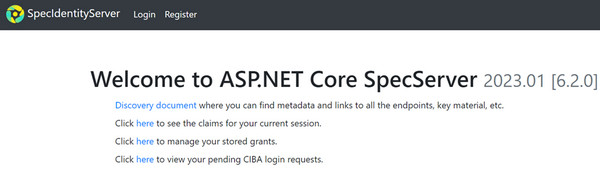
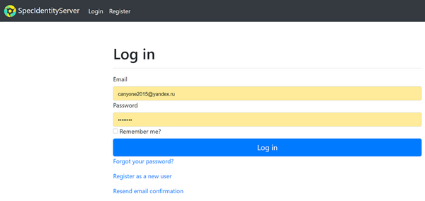
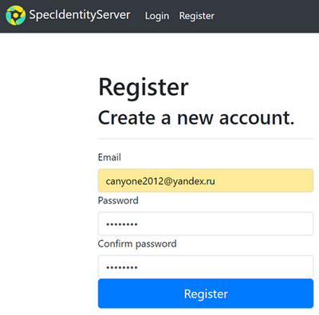
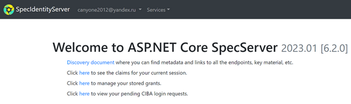
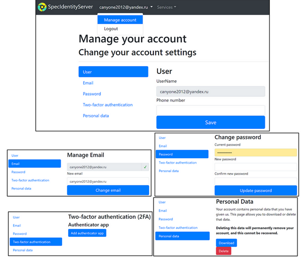
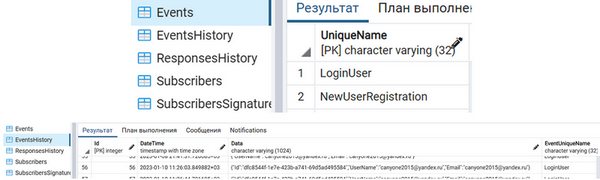
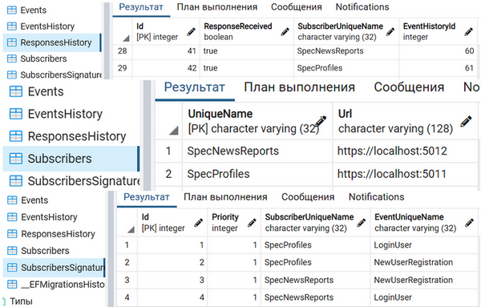
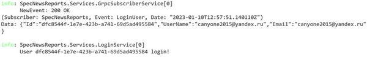
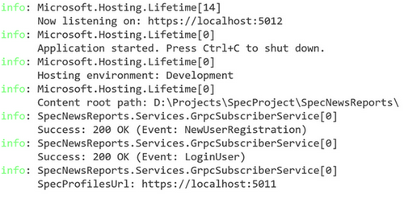
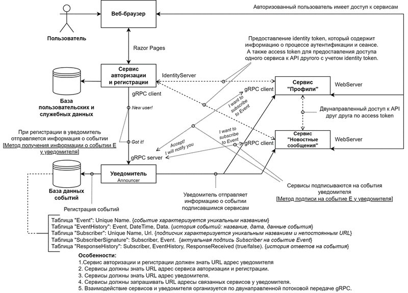

# Microservices Synchronization System

**Система синхронизации микросервисов** — тип программного обеспечения, предназначенного для обеспечения синхронизации различных микросервисов в системе.  
**Микросервисная архитектура** — популярный архитектурный стиль, в котором приложение разделено на небольшие независимые компоненты, которые можно разрабатывать, развертывать и обслуживать относительно независимо друг от друга.  
Это обеспечивает большую гибкость и масштабируемость, поскольку каждый микросервис можно изменить или заменить, не затрагивая всю систему.  

**Цель работы**: разработка системы синхронизации микросервисов.  
Разработка системы синхронизации микросервисов может дать многочисленные преимущества для широкого круга приложений и систем, включая виртуальные предприятия, информационно-аналитические системы и специализированные социальные сети.

## Обзор

**После запуска IdentityServer открывается главная страница веб-приложения.**  

**На главной странице представлен заголовочный контейнер, состоящий из логотипа, названия сервиса, кнопки входа и кнопки регистрации, а также некоторое временное содержимое.  
При нажатии на кнопку Login появляется страница входа в веб-приложение.**  

**При регистрации пользователь указывает Email и пароль с подтверждением.**  

**После регистрации и подтверждения учетной записи, пользователь может войти в свою учетную запись.**  

**Пользователь может изменить настройки учетной записи («Manage account»), а также выйти из приложения («Logout»).**  

**Также пользователь может перейти в микросервисы.**  

**При возникновении событий Announcer получает от IdentityServer информацию о событиях и записывает в базу данных.**  

**Кроме того, в случае наличия подписчиков также заполняются таблицы Subscribers, SubscribersSignatures, ResponsesHistory.**  

**Микросервис Profiles получает данные о событии от Announcer в GrpcSubscriberService, который затем перенаправляет данные в LoginService, который печатает Id вошедшего в систему пользователя.**  

**Микросервис NewsReports получает URL адрес Profiles у Announcer в GrpcSubscriberService.**  
  
**Микросервис NewsReports также получает данные о событиях от Announcer.**

## Архитектура

**Краткое описание**:
1. Сервис авторизации и регистрации обрабатывает аутентификацию и авторизацию пользователей и предоставляет identity и access токены микросервисам, которые в свою очередь предоставляют доступ пользователю к своим функциям.
2. Сервис авторизации и регистрации связывается с уведомителем (Announcer) для отправки данных о новых событиях.
3. Уведомитель хранит данные о событиях и подписчиках в своей базе данных, получает данные о событиях от сервиса авторизации и регистрации и имеет возможность подписывать микросервисы на события с помощью gRPC.
4. Уведомитель учитывает и последовательно переотправляет данные о событиях, на которые были подписаны микросервисы, в случае, если те из-за сбоев не смогли вовремя получить данные о событиях.

**Среди дальнейших путей развития можно выделить**:
1. Детальную проработку всех мест; профилирование функций и определение узких мест с целью дальнейшего исправления.
2. Разделение системы на киберсреды.
3. Использование брокера сообщений RabbitMQ для передачи данных между микросервисами (под вопросом).
4. Контейнеризация приложения .NET (использование Docker).

Система синхронизации микросервисов потенциально может включать в себя функциональные возможности специализированной социальной сети, позволяя пользователям подключаться и сотрудничать друг с другом в режиме реального времени.  
Это может быть особенно полезно для виртуальных предприятий, поскольку может помочь облегчить общение и сотрудничество между членами команды и заинтересованными сторонами.
